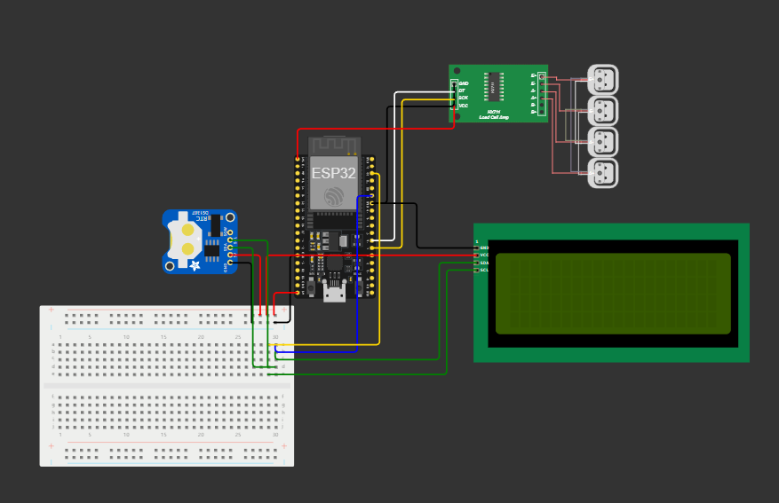

# Projeto NovaGreen(Biomassa para energia)



## Simulação WOKWI
[Wokwi](https://wokwi.com/projects/414805292834012161)
[HiveMQ](https://www.hivemq.com/demos/websocket-client/)

## Descrição

Este projeto utiliza um ESP32 para monitorar o peso de um objeto utilizando um sensor de carga HX711. Os dados de peso são exibidos em um display LCD 20x4 e também enviados para um broker MQTT, juntamente com a data e a hora, para monitoramento remoto. O sistema conecta-se à rede Wi-Fi para realizar a comunicação e utiliza o protocolo MQTT para publicar os dados.

## Funcionalidades

- **Leitura de Peso:** O sensor de carga HX711 é utilizado para medir o peso do objeto.
- **Display LCD:** Exibe o peso, data e hora em um display LCD 20x4.
- **Conexão Wi-Fi:** O ESP32 se conecta à rede Wi-Fi para enviar os dados.
- **MQTT:** Os dados de peso, data e hora são publicados em um broker MQTT.
- **RTC (Relógio em Tempo Real):** Utiliza o RTC DS1307 para capturar a data e hora exatas.

## Requisitos

### Hardware

- **ESP32:** Placa de desenvolvimento para controlar o sistema.
- **Sensor HX711:** Sensor de carga para medir o peso.
- **Display LCD 20x4 com I2C:** Para exibir o peso, data e hora.
- **RTC DS1307:** Para capturar data e hora.
- **Fios e Protoboard:** Para conexão dos componentes.

### Software

- **Arduino IDE:** Para programar o ESP32.
- **Bibliotecas Arduino:**
  - `HX711`: Para o sensor de carga.
  - `LiquidCrystal_I2C`: Para o controle do display LCD.
  - `WiFi`: Para a conexão com a rede Wi-Fi.
  - `PubSubClient`: Para a comunicação MQTT.
  - `RTClib`: Para o controle do RTC.
  - `ArduinoJson`: Para a criação e envio de dados JSON via MQTT.

## Instalação

1. **Instalar a IDE Arduino:**
   - Baixe e instale a [Arduino IDE](https://www.arduino.cc/en/software).

2. **Configuração do ESP32:**
   - No Arduino IDE, vá até **Arquivo > Preferências** e adicione o link do gerenciador de placas para o ESP32 em "URLs Adicionais para Gerenciadores de Placas" com o seguinte URL:
     ```
     https://dl.espressif.com/dl/package_esp32_index.json
     ```
   - Em seguida, vá em **Ferramentas > Placa > Gerenciador de Placas** e busque por `esp32`, depois instale a placa.

3. **Instalar Bibliotecas:**
   - No Arduino IDE, vá em **Sketch > Incluir Biblioteca > Gerenciar Bibliotecas...**
   - Busque e instale as seguintes bibliotecas:
     - `HX711`
     - `LiquidCrystal_I2C`
     - `WiFi`
     - `PubSubClient`
     - `RTClib`
     - `ArduinoJson`

4. **Conexões de Hardware:**
   - Conecte o **HX711** ao pino 16 (DOUT) e 4 (SCK) do ESP32.
   - Conecte o display **LCD 20x4 com I2C** aos pinos SDA (GPIO 21) e SCL (GPIO 22).
   - Conecte o **RTC DS1307** via I2C (SDA no GPIO 21 e SCL no GPIO 22).

## Configuração do MQTT

Este projeto utiliza um servidor MQTT público para publicar os dados. O broker utilizado é o `broker.hivemq.com`. Caso queira usar um broker diferente, altere a variável `mqtt_server` e configure a porta (`mqtt_port`) no código.
